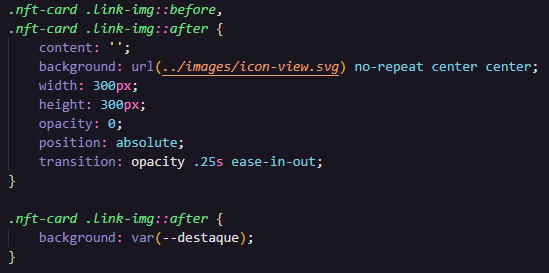
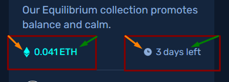

# NFT preview card component

Fiz este desafio, disponibilizado no Front-end Mentor.

----

## O desafio

Consiste em criar um cartão-NFT. Fiz utilizando propriedades do `display: flex;`

### Tecnologias utilizadas
- HTML
- CSS

### Dificuldades
- Efeito `:hover` na imagem do NFT

A parte mais complicada porque tive que inserir 2 elementos por cima da imagem do NFT. Sendo 1, o `background: var(--destaque);` e o outro, a imagem do "olhinho". Veja como foi feito:

- utilização dos pseudo-elementos *::before - laranja*  e *::after - verde* para inserir imagens e informações (respectivamente). Veja abaixo, onde foi inserido:

*Foi uma maneira bem bacana que vou passar a utilizar em projetos futuros.*

---
Essas são as principais informações a serem explicadas. Até o próximo projeto ***:D***